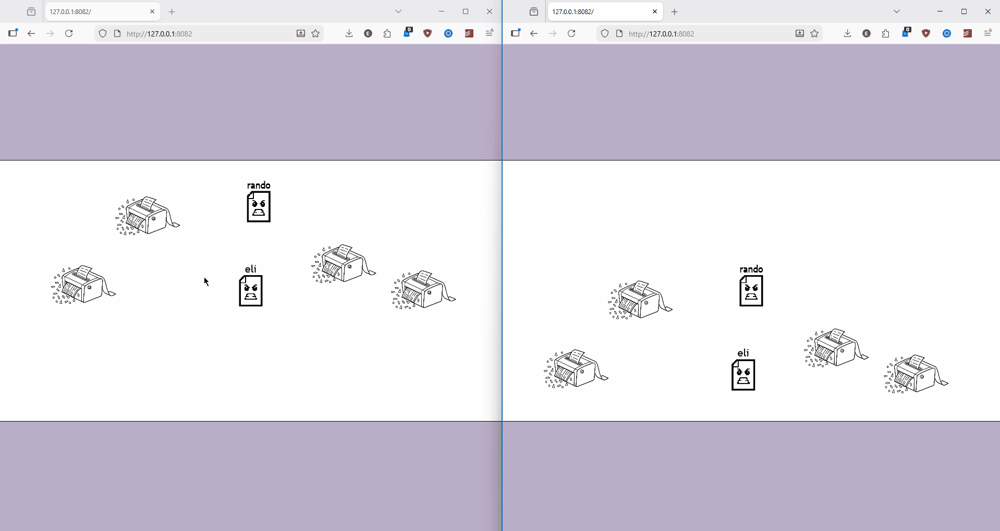

# Paper & Scissors

A silly little multiplayer game where you run around as a piece of paper and throw scissors at each other.

That's literally it. That's the game.

## Incredibly Low Res Gameplay Gif



## Gameplay

- **Left click** to move your paper
- **Right click** to throw scissors at someone
- Hit another player's paper with scissors and they die
- Get hit by scissors and you die - you become a sad dead piece of paper and can't do anything :(

## How It Works (kind of)
When you move or throw scissors, it tells the server, which tells everyone else. There's also some math happening to make sure all players see projectiles and movement in roughly the same place at roughly the same time (accounting for network delay). Surprisingly non-trivial for a dumb game about paper.

## Tech Stack

- **Frontend:** Vanilla JavaScript (Canvas API)
- **Backend:** Node.js
- **Communication:** HTTP

## Setup & Running

**Requirements:** Node.js

```bash
node server.js
```

Then open your browser to:

```
http://127.0.0.1:8082
```

## Instructions to play with friends
Step 1: &ensp;Have friends\
Step 2: &ensp;Change the `host` in `server.js` to your local network IP and send them the link

* **Note:** This is untested as I do not fullfill the initial requirement for setup. This should work according to my Networks class though ¯\\_(ツ)_/¯
* **Extra Note** Was going to add interactions with paper shredders but wayyy too much work
